## Getting Started

### Short story

If you've got Docker installed then you can run the dashboard from docker hub images with this command:

```curl https://raw.githubusercontent.com/digitalcredentials/docs/jc-compose-files/deployment-guide/docker-compose-files/admin-dashboard-compose.yaml | docker compose -f - up```

Alternatively, if you've checked out this repository, and want to run the dashboard from the source code, you run (from the root directory of this repo):

```docker compose up```

It'll likely take a minute or two to download all the images from Docker Hub, but once that's all done, you should be able to open a web browser to [http://localhost:3000](http://localhost:3000).

You've now got a working admin-dashboard up and running.

You'll initially be prompted to create a first user. Do that and then...

### Longer story

This guide now continues on, explaining the system and progressively helping you add features as you go.

So first you'll want to try it out.

1. First up, create a template for the Verifiable Credentials that you'd like to issue: 

a) Open the credential templates screen and start a new template, like so:

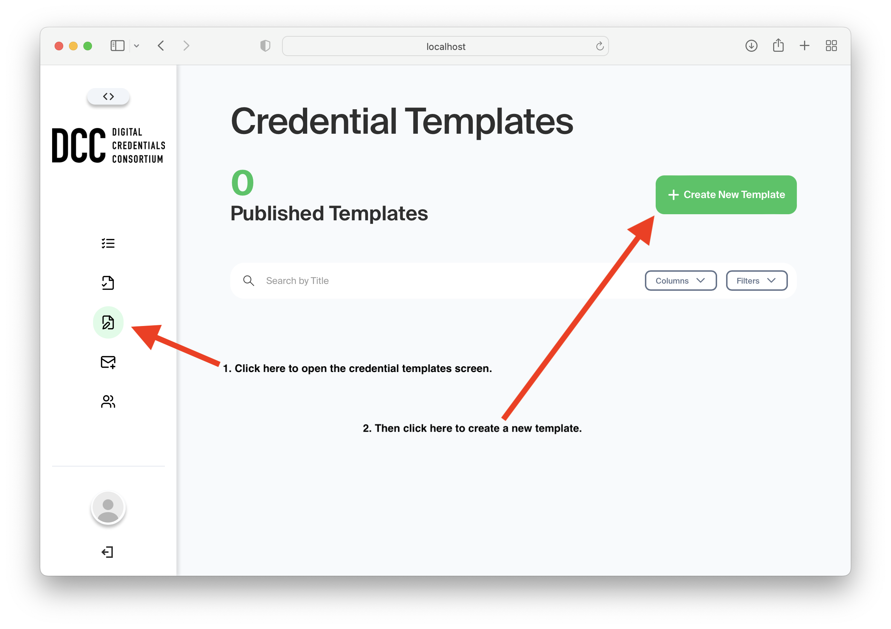

b) Give your template a 'Title', optionally a 'Description', add any 'Internal Notes' you might like to keep for posterity, and add the template itself:

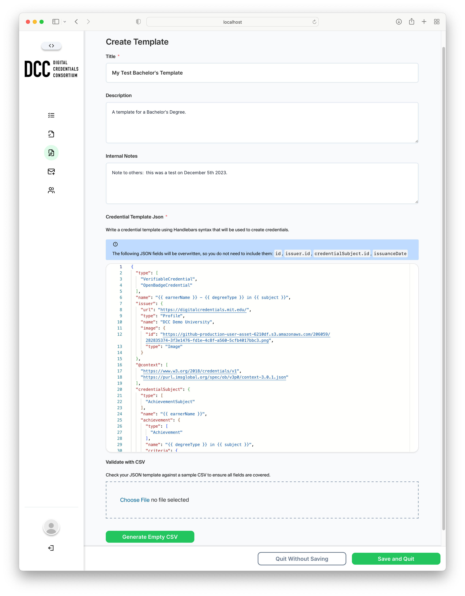

Here is the json that you can paste into that 'Credential Template Json' field:

```json
{
  "type": [
    "VerifiableCredential",
    "OpenBadgeCredential"
  ],
  "name": "{{ earnerName }} - {{ degreeType }} in {{ subject }}",
  "issuer": {
    "url": "https://digitalcredentials.mit.edu/",
    "type": "Profile",
    "name": "DCC Demo University",
    "image": {
      "id": "https://github-production-user-asset-6210df.s3.amazonaws.com/206059/282835374-3f3e1476-fd1e-4c8f-a560-5cfb4017bbc3.png",
      "type": "Image"
    }
  },
  "@context": [
    "https://www.w3.org/2018/credentials/v1",
    "https://purl.imsglobal.org/spec/ob/v3p0/context-3.0.1.json"
  ],
  "credentialSubject": {
    "type": [
      "AchievementSubject"
    ],
    "name": "{{ earnerName }}",
    "achievement": {
      "type": [
        "Achievement"
      ],
      "name": "{{ degreeType }} in {{ subject }}",
      "criteria": {
        "type": "Criteria",
        "narrative": "{{ earnerName }} has fulfilled the requirements to earn this {{ degreeType }} in {{ subject }}."
      },
      "description": "DCC Demo University {{ degreeType }} in {{ subject }}",
      "fieldOfStudy": "I{{ subject }}",
      "achievementType": "BachelorDegree"
    }
  }
}
```

You'll notice there is also an option to validate the template against a CSV file, to ensure the fields in the CSV match the fields in the template, but we'll skip that for now. You'd use this if you already had a CSV you intended to use, which we don't yet have.  We do have the option to click the 'Generate Empty CSV' button at the button of the screen, which will generate a skeleton CSV for us that includes the fields in our handlebars template. So click that, which will generate and download the CSV (to your downloads folder or wherever you computer prefers to put such things). We'll fill that in later.

Click 'Save and Quit'

Okay, we've finished setting up the credential template.

2. Now create an email template for the emails that are sent to credential recipients:

a) Open the email templates screen and start a new template, like so:

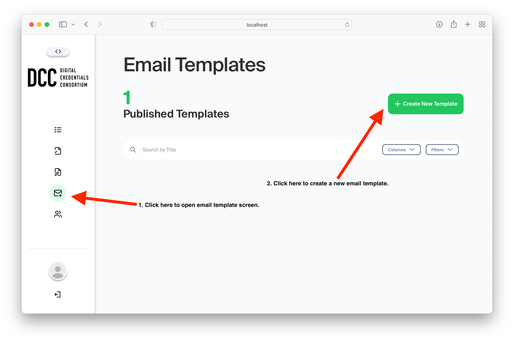

b) Give your template a 'Title', add any 'Internal Notes' you'd like, a 'From' email address, an 'Email Subject Title' and finally either use the default template provided in the 'Email Templates Handlebars Code' field, or add your own, like the sample just below the screenshot.

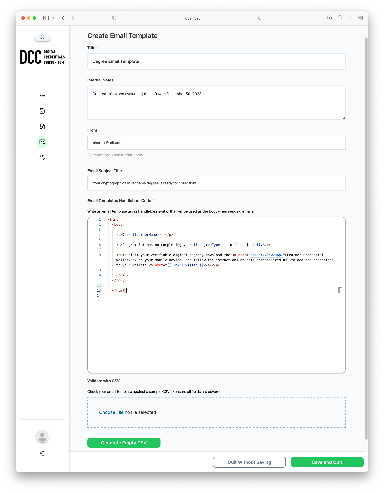

Here's the html that you can copy and paste into that field:

```html
  <html>
  <body>

    <p>Dear {{earnerName}}! </p>
    
    <p>Congratulations on completing your {{ degreeType }} in {{ subject }}.</p>
    
    <p>To claim your verifiable digital degree, download the <a href="https://lcw.app/">Learner Credential Wallet</a> on your mobile device, and follow the istructions at this personalized url to add the credential to your wallet: <a href="{{link}}">{{link}}</a></p>
    
    </div>
  </body>

  </html>
  ```

You can again validate the template against a CSV file to ensure your CSV file contains at least those fields in the template.  You can also generate a skeleton CSV file with columns matching the variables in your template, but we've already generated our skeleton CSV file up in step 1 when we created our credential template.

Click 'Save and Quit'

Okay, we've finished setting up the email template.

3. Now we are reading to add data to issue a batch of credentials.

a) Start the batch:

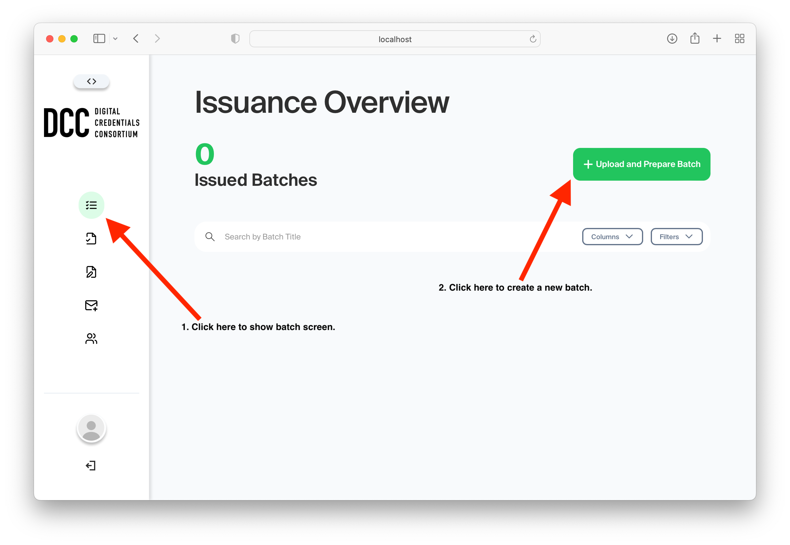

b) Add batch details:

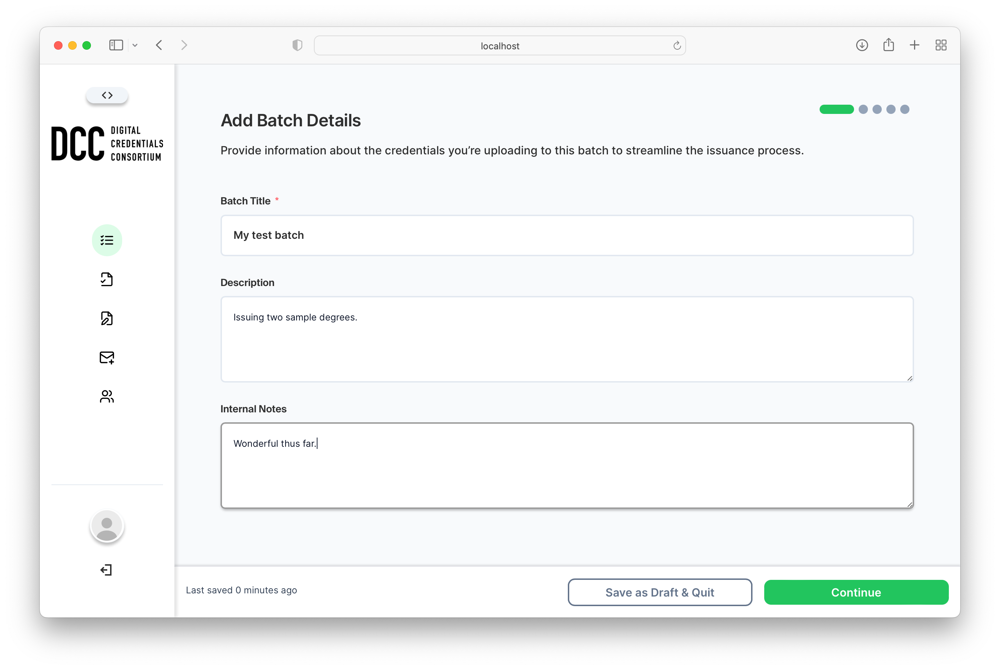

and then click Continue

c) Select the credential template we created:

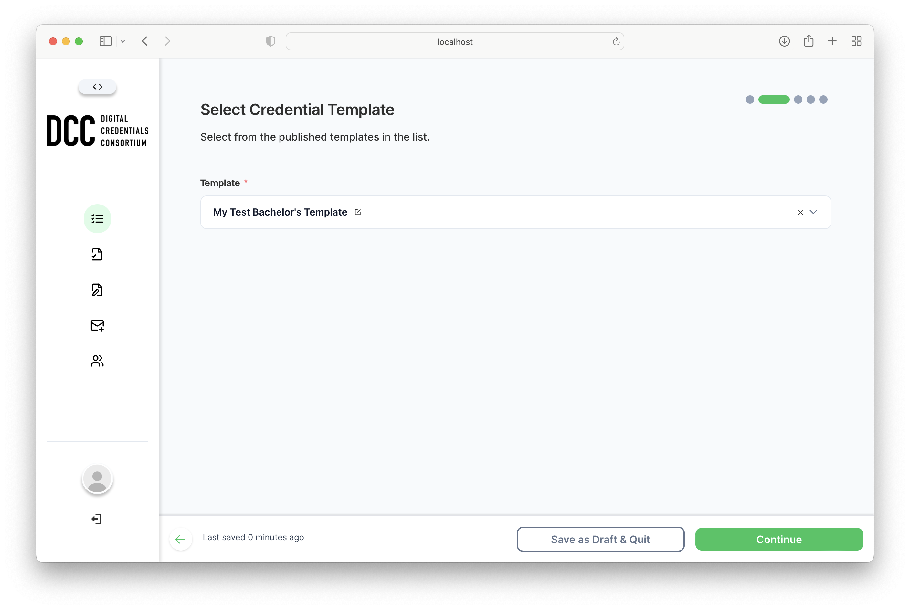

and then click Continue

d) Upload a CSV file with credential data.  

Here you'll first have to populate that CSV skeleton we created earlier.  So find the file, open it up in a text editor and replace the contents with something like the following:

```
earnerName,degreeType,subject,credentialName,emailAddress
Sam Salmon,Bachelor of Science,Computer Science,Bachelors,sam@example.org
Taylor Tuna,Master of Science,Biology,Masters,taylor@example.org
```

Now upload the CSV:

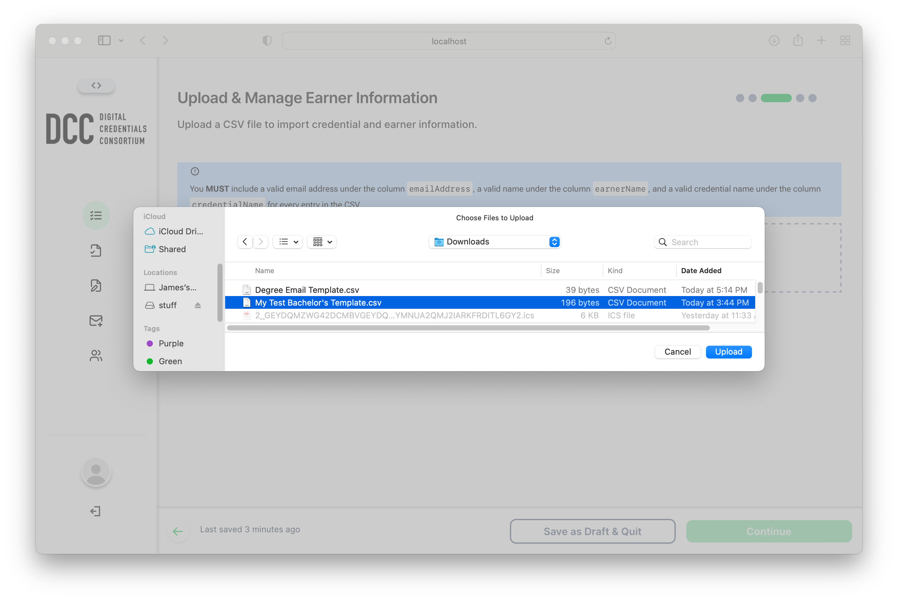

You should now see something like this screen, listing your uploaded credentials. You could adjust the data at this point, but we'll continue on.

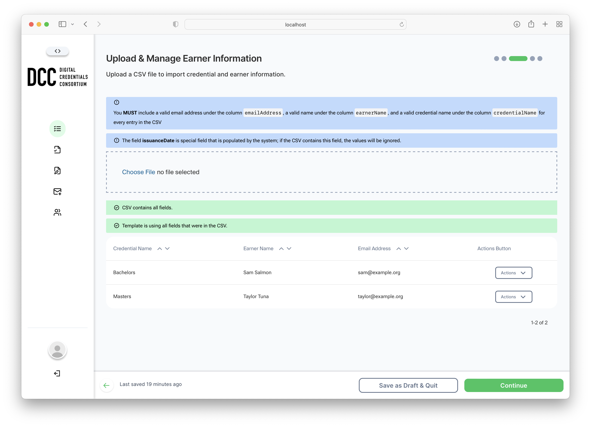

Click Continue

e) Select our email template.

Add an email address to 'Email From'. This is the email address from which you'll send out emails.

Choose the template we created earlier.

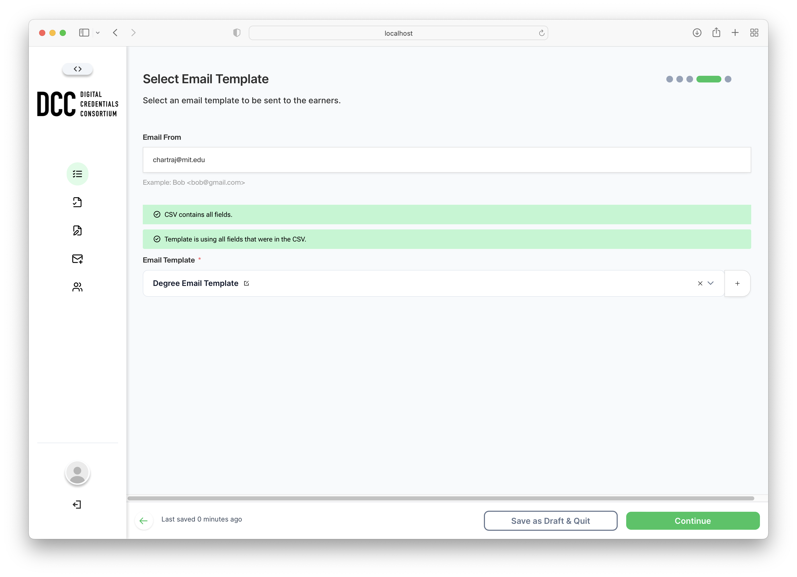 

Click Continue

f) You should now see a Confirmation screen like the following:

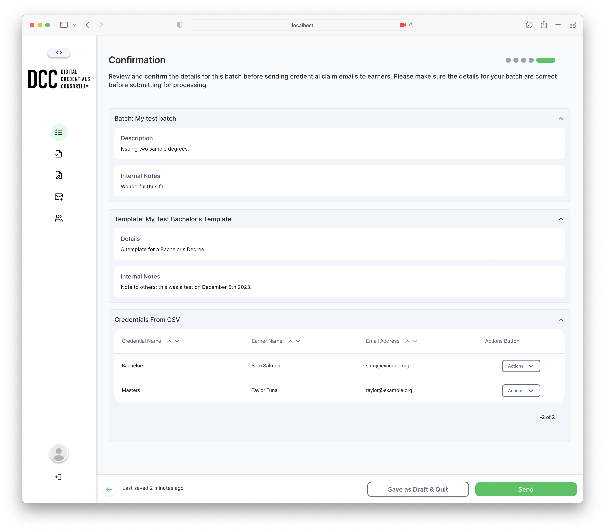 

So this is the point where you could - if you were ready - click 'Send' to send out emails to the 
credential recipients, inviting them to collect their credentials.  But, we haven't configured an
email server, so the emails won't actually be sent.

So hopefully to this point you've gotten a sense of how things work on the adminstrative side.

If you'd now like to get a sense of what the student sees, and how they collect their credentials, we've got to configure our application by specifying a mail server to send emails, and we need to expose our collection endpoint so the [Learner Credential Wallet](http://lcw.app) can collect our credentials.

Let's start with email... 

#### Configure mail

You'll need an outgoing SMTP mail server like sendgrid or potentially your own current email address if you can directly send emails to your server.

Take a look at the [.env.sample](.env.sample) to see how to set the three variables for mail:

```
SMTP_HOST=<SMTP HOST>
SMTP_USER=<SMTP USER>
SMTP_PASS=<SMTP PASSWORD>
```

Once that's set you can now 'Send' your credentials as described in the prior step, but first...

#### Collection endpoint

You can now send out the emails, which will contain a link that the student can click
to collect their credentials. That link takes the student to a claim page from which they
can click another link that will open a wallet that will download the credential.

So we need to configure those two links for the claim page and collection endpoint. They are
similarly set in the the [.env.sample](.env.sample) as:

```
CLAIM_PAGE_URL=http://localhost:8080
PAYLOAD_PUBLIC_SERVER_URL=http://localhost:3000
```

The first is where the claim page runs, and the second is where the admin-dashboard (this repo) runs.

The defaults are set to localhost, but to be useful with the wallet, which is an app that runs on a phone, they'll have to be set to a publically accessible url. This is the point where you 
need to deploy your app to a server with a public IP or domain name. Essentially, you'll need to run the same docker compose, but on a public server, ideally with a domain name, then set it for the claim page and dashboard.

We've got another docker compose file that you can use as a template that includes nginx configurations to support your domain name and certificates. TODO add nginx compose.
